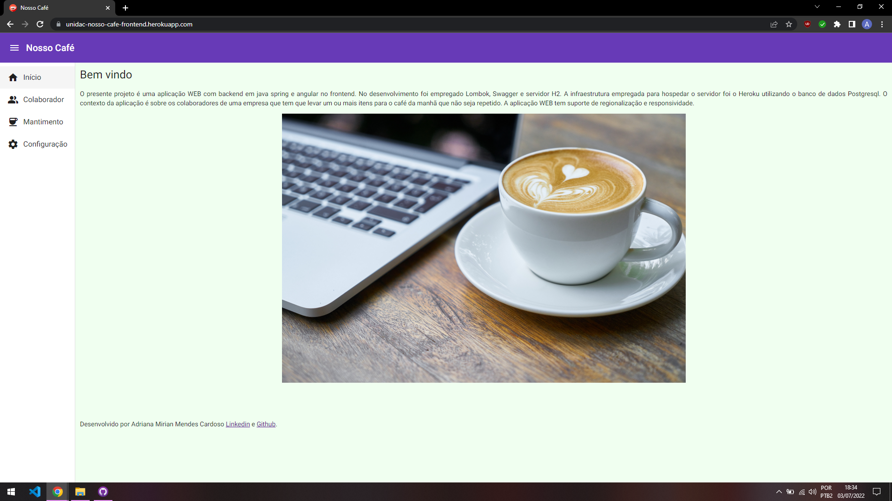
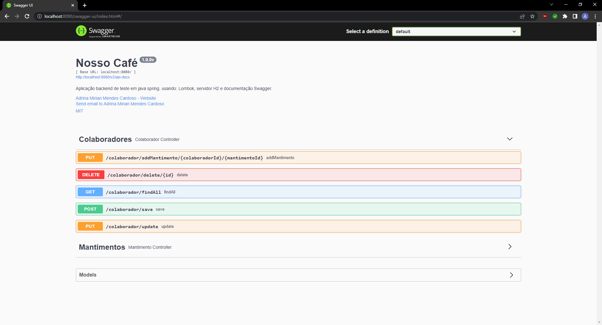

[](./LICENSE)       

# Nosso Café

O presente projeto é uma aplicação web composta por backend em Java com Spring Boot e frontend desenvolvido em Angular. Durante o desenvolvimento, foram utilizadas as bibliotecas Lombok e Swagger, além do banco de dados em memória H2 para testes. A aplicação está hospedada na plataforma Heroku, utilizando o banco de dados PostgreSQL.

O contexto da aplicação envolve o gerenciamento de colaboradores de uma empresa que devem levar um ou mais itens para o café da manhã, evitando repetições.



## Heroku

O projeto está instanciado no Heroku e está disponível nos links abaixo:

### Frontend

<https://unidac-nosso-cafe-frontend.herokuapp.com/>

### Backend

<https://unidac-nosso-cafe-backend.herokuapp.com/>

É importante ressaltar que a conta utilizada é gratuita, portanto ao acessar pela primeira vez irá demorar um pouco para iniciar (devido às limitações da conta grátis).

## Swagger

O projeto foi desenvolvido com a documentação Swagger, que está disponível no aquivo ```swagger.json```.

## Deploy

1. Clone o repositório:
   ```bash
   git clone git clone https://github.com/AdrianaMendes/unidac-desafio-java.git
   ```

2. Navegue até o diretório do projeto e execute:
   ```bash
   ./mvnw spring-boot:run
   ```

3. Acesse o sistema em:
   ```
   http://localhost:8080/swagger-ui/index.html

Para testar localmente o Swagger e a aplicação com o H2 apenas alterar o arquivo properties do backend conforme mostrado abaixo.

```
# Database configuration
spring.datasource.url=jdbc:h2:mem:spring
spring.datasource.username=admin
spring.datasource.password=

spring.h2.console.enabled=true
spring.h2.console.path=/h2-console

#spring.jpa.generate-ddl=true
#spring.jpa.hibernate.ddl-auto=create
```



## Banco de dados

- O projeto utiliza o **H2 Database** em memória.
  ```
  http://localhost:8080/h2-console
  ```
  - JDBC URL: `jdbc:h2:mem:spring`
  - Usuário: `admin`

## Licença

Este projeto está sob licença Apache 2.0 © 2022 Adriana Mirian Mendes Cardoso.
Para mais informações acesse o arquivo :scroll: `LICENSE`.

## Contato

**Adriana Cardoso**  
Desenvolvedora Java | Spring Boot | Angular  

- [LinkedIn](https://www.linkedin.com/in/amendescardoso/)  
- 📧 adrianamirianmc@gmail.com
