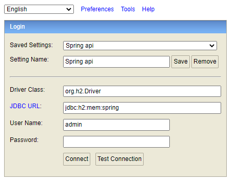

[](./LICENSE)       

# Nosso Café

O presente projeto é uma aplicação WEB com backend em java spring e angular no frontend. No desenvolvimento foi empregado Lombok, Swagger e servidor H2. A infraestrutura empregada para hospedar o servidor foi o Heroku utilizando o banco de dados Postgresql. O contexto da aplicação é sobre os colaboradores de uma empresa que tem que levar um ou mais itens para o café da manhã que não seja repetido. A aplicação WEB tem suporte de regionalização e responsividade.


## Heroku

O projeto está instanciado no Heroku e está disponível nos links abaixo:

### Frontend

<https://unidac-nosso-cafe-frontend.herokuapp.com/>

### Backend

<https://unidac-nosso-cafe-backend.herokuapp.com/>

É importante ressaltar que a conta utilizada é gratuita, portanto ao acessar pela primeira vez irá demorar um pouco para iniciar (devido às limitações da conta grátis).

## Swagger

O projeto foi desenvolvido com a documentação Swagger, que está disponível no aquivo ```swagger.json```.

## Teste localhost

Para testar localmente o Swagger e a aplicação com o H2 apenas alterar o arquivo properties do backend conforme mostrado abaixo.

```
    # Database configuration
    spring.datasource.url=jdbc:h2:mem:spring
    spring.datasource.username=admin
    spring.datasource.password=

    spring.h2.console.enabled=true
    spring.h2.console.path=/h2-console

    #spring.jpa.generate-ddl=true
    #spring.jpa.hibernate.ddl-auto=create
```

Para acessar a documentação swagger acesse esta URL: http://localhost:8080/swagger-ui/index.html


Para acessar o banco de dados H2: http://localhost:8080/h2-console/



## Licença

Este projeto está sob licença Apache 2.0 © 2022 Adriana Mirian Mendes Cardoso.
Para mais informações acesse o arquivo :scroll: `LICENSE`.

## Contato

:email: E-Mail: ​[adrianamirianmc@gmail.com](adrianamirianmc@gmail.com)

:clipboard: Linkedin: ​[https://www.linkedin.com/in/adriana-mirian-mendes-cardoso](https://www.linkedin.com/in/adriana-mirian-mendes-cardoso)

:package: GitHub:  [https://github.com/AdrianaMendes](https://github.com/AdrianaMendes)
